<picture>
    <source media="(prefers-color-scheme: dark)" srcset=".assets/img/banner/banner_dark.svg">
    <source media="(prefers-color-scheme: light)" srcset=".assets/img/banner/banner_light.svg">
    
</picture>

 
 

## Hello!

I'm a research scientist completing a PhD in Computational Biophysics at the University of Oxford, which has focused on the development of a new computing architecture for molecular dynamics simulations.

I am particularly interested in high-level programming in Python for data science and machine learning, as well as low-level engineering with FPGAs, microcontrollers, and custom analog–digital circuits.

Feel free to reach out on Github or [by email](william.rochira@hotmail.co.uk) if you find any of these projects interesting or useful - I'd love to chat!

 

## Skills

    <b>Languages</b>

    <picture>
        <source media="(prefers-color-scheme: dark)" srcset=".assets/img/skill_badges/python_light.svg">
        <source media="(prefers-color-scheme: light)" srcset=".assets/img/skill_badges/python_dark.svg">
        
    </picture> &nbsp;
    <picture>
        <source media="(prefers-color-scheme: dark)" srcset=".assets/img/skill_badges/c_light.svg">
        <source media="(prefers-color-scheme: light)" srcset=".assets/img/skill_badges/c_dark.svg">
        
    </picture> &nbsp;
    <picture>
        <source media="(prefers-color-scheme: dark)" srcset=".assets/img/skill_badges/verilog_light.svg">
        <source media="(prefers-color-scheme: light)" srcset=".assets/img/skill_badges/verilog_dark.svg">
        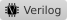
    </picture> &nbsp;
    <picture>
        <source media="(prefers-color-scheme: dark)" srcset=".assets/img/skill_badges/php_light.svg">
        <source media="(prefers-color-scheme: light)" srcset=".assets/img/skill_badges/php_dark.svg">
        
    </picture> &nbsp;
    <picture>
        <source media="(prefers-color-scheme: dark)" srcset=".assets/img/skill_badges/javascript_light.svg">
        <source media="(prefers-color-scheme: light)" srcset=".assets/img/skill_badges/javascript_dark.svg">
        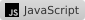
    </picture> &nbsp;
    <picture>
        <source media="(prefers-color-scheme: dark)" srcset=".assets/img/skill_badges/mysql_light.svg">
        <source media="(prefers-color-scheme: light)" srcset=".assets/img/skill_badges/mysql_dark.svg">
        
    </picture> &nbsp;
    <picture>
        <source media="(prefers-color-scheme: dark)" srcset=".assets/img/skill_badges/gnubash_light.svg">
        <source media="(prefers-color-scheme: light)" srcset=".assets/img/skill_badges/gnubash_dark.svg">
        
    </picture> &nbsp;
    <picture>
        <source media="(prefers-color-scheme: dark)" srcset=".assets/img/skill_badges/java_light.svg">
        <source media="(prefers-color-scheme: light)" srcset=".assets/img/skill_badges/java_dark.svg">
        
    </picture> &nbsp;
    <picture>
        <source media="(prefers-color-scheme: dark)" srcset=".assets/img/skill_badges/cplusplus_light.svg">
        <source media="(prefers-color-scheme: light)" srcset=".assets/img/skill_badges/cplusplus_dark.svg">
        
    </picture> &nbsp;
    <picture>
        <source media="(prefers-color-scheme: dark)" srcset=".assets/img/skill_badges/dotnet_light.svg">
        <source media="(prefers-color-scheme: light)" srcset=".assets/img/skill_badges/dotnet_dark.svg">
        
    </picture> &nbsp;

    <b>Data Science and ML</b>

    <picture>
        <source media="(prefers-color-scheme: dark)" srcset=".assets/img/skill_badges/numpy_light.svg">
        <source media="(prefers-color-scheme: light)" srcset=".assets/img/skill_badges/numpy_dark.svg">
        
    </picture> &nbsp;
    <picture>
        <source media="(prefers-color-scheme: dark)" srcset=".assets/img/skill_badges/scipy_light.svg">
        <source media="(prefers-color-scheme: light)" srcset=".assets/img/skill_badges/scipy_dark.svg">
        
    </picture> &nbsp;
    <picture>
        <source media="(prefers-color-scheme: dark)" srcset=".assets/img/skill_badges/pandas_light.svg">
        <source media="(prefers-color-scheme: light)" srcset=".assets/img/skill_badges/pandas_dark.svg">
        
    </picture> &nbsp;
    <picture>
        <source media="(prefers-color-scheme: dark)" srcset=".assets/img/skill_badges/matplotlib_light.svg">
        <source media="(prefers-color-scheme: light)" srcset=".assets/img/skill_badges/matplotlib_dark.svg">
        
    </picture> &nbsp;
    <picture>
        <source media="(prefers-color-scheme: dark)" srcset=".assets/img/skill_badges/tensorflow_light.svg">
        <source media="(prefers-color-scheme: light)" srcset=".assets/img/skill_badges/tensorflow_dark.svg">
        
    </picture> &nbsp;
    <picture>
        <source media="(prefers-color-scheme: dark)" srcset=".assets/img/skill_badges/keras_light.svg">
        <source media="(prefers-color-scheme: light)" srcset=".assets/img/skill_badges/keras_dark.svg">
        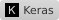
    </picture> &nbsp;
    <picture>
        <source media="(prefers-color-scheme: dark)" srcset=".assets/img/skill_badges/scikitlearn_light.svg">
        <source media="(prefers-color-scheme: light)" srcset=".assets/img/skill_badges/scikitlearn_dark.svg">
        
    </picture> &nbsp;

    <b>Electronic Engineering</b>

    <picture>
        <source media="(prefers-color-scheme: dark)" srcset=".assets/img/skill_badges/raspberrypi_light.svg">
        <source media="(prefers-color-scheme: light)" srcset=".assets/img/skill_badges/raspberrypi_dark.svg">
        
    </picture> &nbsp;
    <picture>
        <source media="(prefers-color-scheme: dark)" srcset=".assets/img/skill_badges/arduino_light.svg">
        <source media="(prefers-color-scheme: light)" srcset=".assets/img/skill_badges/arduino_dark.svg">
        
    </picture> &nbsp;
    <picture>
        <source media="(prefers-color-scheme: dark)" srcset=".assets/img/skill_badges/espressif_light.svg">
        <source media="(prefers-color-scheme: light)" srcset=".assets/img/skill_badges/espressif_dark.svg">
        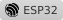
    </picture> &nbsp;
    <picture>
        <source media="(prefers-color-scheme: dark)" srcset=".assets/img/skill_badges/xilinx_light.svg">
        <source media="(prefers-color-scheme: light)" srcset=".assets/img/skill_badges/xilinx_dark.svg">
        
    </picture> &nbsp;
    <picture>
        <source media="(prefers-color-scheme: dark)" srcset=".assets/img/skill_badges/ltspice_light.svg">
        <source media="(prefers-color-scheme: light)" srcset=".assets/img/skill_badges/ltspice_dark.svg">
        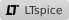
    </picture> &nbsp;
    <picture>
        <source media="(prefers-color-scheme: dark)" srcset=".assets/img/skill_badges/logisim_light.svg">
        <source media="(prefers-color-scheme: light)" srcset=".assets/img/skill_badges/logisim_dark.svg">
        
    </picture> &nbsp;
    <picture>
        <source media="(prefers-color-scheme: dark)" srcset=".assets/img/skill_badges/proteus_light.svg">
        <source media="(prefers-color-scheme: light)" srcset=".assets/img/skill_badges/proteus_dark.svg">
        
    </picture> &nbsp;
    <picture>
        <source media="(prefers-color-scheme: dark)" srcset=".assets/img/skill_badges/tina_light.svg">
        <source media="(prefers-color-scheme: light)" srcset=".assets/img/skill_badges/tina_dark.svg">
        
    </picture> &nbsp;
    <picture>
        <source media="(prefers-color-scheme: dark)" srcset=".assets/img/skill_badges/kicad_light.svg">
        <source media="(prefers-color-scheme: light)" srcset=".assets/img/skill_badges/kicad_dark.svg">
        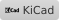
    </picture> &nbsp;
    <picture>
        <source media="(prefers-color-scheme: dark)" srcset=".assets/img/skill_badges/vivado_light.svg">
        <source media="(prefers-color-scheme: light)" srcset=".assets/img/skill_badges/vivado_dark.svg">
        
    </picture> &nbsp;

    <b>Other</b>

    <picture>
        <source media="(prefers-color-scheme: dark)" srcset=".assets/img/skill_badges/sublimetext_light.svg">
        <source media="(prefers-color-scheme: light)" srcset=".assets/img/skill_badges/sublimetext_dark.svg">
        
    </picture> &nbsp;
    <picture>
        <source media="(prefers-color-scheme: dark)" srcset=".assets/img/skill_badges/vscode_light.svg">
        <source media="(prefers-color-scheme: light)" srcset=".assets/img/skill_badges/vscode_dark.svg">
        
    </picture> &nbsp;
    <picture>
        <source media="(prefers-color-scheme: dark)" srcset=".assets/img/skill_badges/blender_light.svg">
        <source media="(prefers-color-scheme: light)" srcset=".assets/img/skill_badges/blender_dark.svg">
        
    </picture> &nbsp;
    <picture>
        <source media="(prefers-color-scheme: dark)" srcset=".assets/img/skill_badges/photoshop_light.svg">
        <source media="(prefers-color-scheme: light)" srcset=".assets/img/skill_badges/photoshop_dark.svg">
        
    </picture> &nbsp;
    <picture>
        <source media="(prefers-color-scheme: dark)" srcset=".assets/img/skill_badges/illustrator_light.svg">
        <source media="(prefers-color-scheme: light)" srcset=".assets/img/skill_badges/illustrator_dark.svg">
        
    </picture> &nbsp;
    <picture>
        <source media="(prefers-color-scheme: dark)" srcset=".assets/img/skill_badges/git_light.svg">
        <source media="(prefers-color-scheme: light)" srcset=".assets/img/skill_badges/git_dark.svg">
        
    </picture> &nbsp;
    <picture>
        <source media="(prefers-color-scheme: dark)" srcset=".assets/img/skill_badges/slurm_light.svg">
        <source media="(prefers-color-scheme: light)" srcset=".assets/img/skill_badges/slurm_dark.svg">
        
    </picture> &nbsp;
    <picture>
        <source media="(prefers-color-scheme: dark)" srcset=".assets/img/skill_badges/gromacs_light.svg">
        <source media="(prefers-color-scheme: light)" srcset=".assets/img/skill_badges/gromacs_dark.svg">
        
    </picture> &nbsp;
    <picture>
        <source media="(prefers-color-scheme: dark)" srcset=".assets/img/skill_badges/mdanalysis_light.svg">
        <source media="(prefers-color-scheme: light)" srcset=".assets/img/skill_badges/mdanalysis_dark.svg">
        
    </picture> &nbsp;
    <picture>
        <source media="(prefers-color-scheme: dark)" srcset=".assets/img/skill_badges/ccp4_light.svg">
        <source media="(prefers-color-scheme: light)" srcset=".assets/img/skill_badges/ccp4_dark.svg">
        
    </picture> &nbsp;
    <picture>
        <source media="(prefers-color-scheme: dark)" srcset=".assets/img/skill_badges/pymol_light.svg">
        <source media="(prefers-color-scheme: light)" srcset=".assets/img/skill_badges/pymol_dark.svg">
        
    </picture> &nbsp;
    <picture>
        <source media="(prefers-color-scheme: dark)" srcset=".assets/img/skill_badges/qiskit_light.svg">
        <source media="(prefers-color-scheme: light)" srcset=".assets/img/skill_badges/qiskit_dark.svg">
        
    </picture> &nbsp;

<!-- TODO: GitHub Stats -->

 

## Featured Projects

<table width="100%">
    <tr>
        <td width="33%" height="200" align="center">
            

            <picture>
                <source media="(prefers-color-scheme: dark)" srcset=".assets/img/project_icons/iris_light.svg">
                <source media="(prefers-color-scheme: light)" srcset=".assets/img/project_icons/iris_dark.svg">
                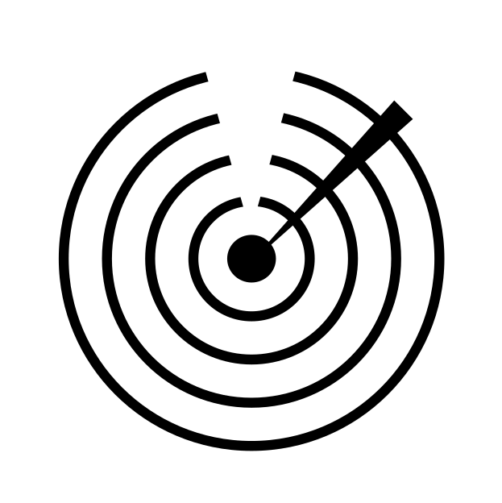
            </picture>
             
            <b>Iris Validation</b>
            

            
Interactive graphical validation tool for 3D protein models. Integrated into CCP4i2, used by structural biologists worldwide.

            

            <code>Python</code> <code>JavaScript</code> <code>Biophysics</code>
        </td>
        <td width="33%" height="200" align="center">
            

            <picture>
                <source media="(prefers-color-scheme: dark)" srcset=".assets/img/project_icons/analog_light.svg">
                <source media="(prefers-color-scheme: light)" srcset=".assets/img/project_icons/analog_dark.svg">
                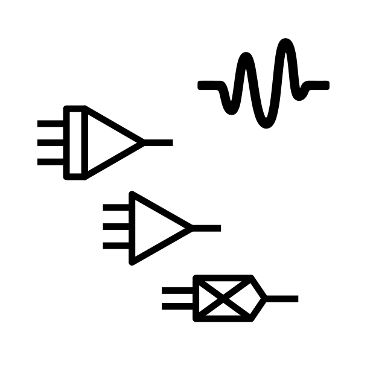
            </picture>
             
            <b>Analog Computing Elements</b>
            

            
Complete library of analog computing elements for LTspice with numerical, ideal, and real-component implementations.

            

            <code>LTspice</code> <code>Analog Computing</code>
        </td>
        <td width="33%" height="200" align="center">
            

            <picture>
                <source media="(prefers-color-scheme: dark)" srcset=".assets/img/project_icons/water_light.svg">
                <source media="(prefers-color-scheme: light)" srcset=".assets/img/project_icons/water_dark.svg">
                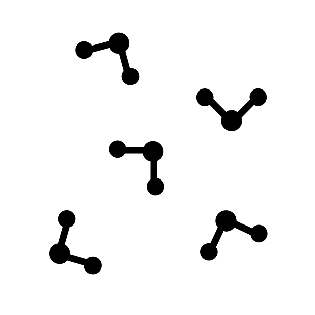
            </picture>
             
            <b>Water MD Engines</b>
            

            
Custom MD simulation engines in Python and C, with tabulated force fields optimised for hardware acceleration.

            

            <code>Python</code> <code>C</code> <code>Molecular Dynamics</code>
        </td>
    </tr>
    <tr>
        <td width="33%" height="200" align="center">
            

            <picture>
                <source media="(prefers-color-scheme: dark)" srcset=".assets/img/project_icons/fpga_light.svg">
                <source media="(prefers-color-scheme: light)" srcset=".assets/img/project_icons/fpga_dark.svg">
                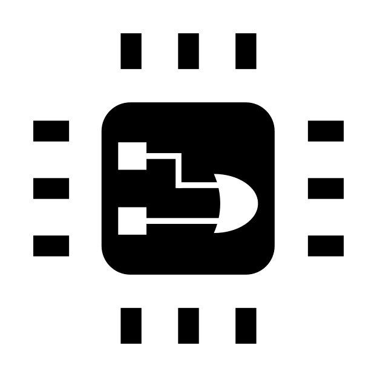
            </picture>
             
            <b>FPGA Float Converters</b>
            

            
IEEE-754 floating-point to fixed-point converters in Verilog, synthesised and tested on Xilinx FPGAs.

            

            <code>Verilog</code> <code>FPGA</code> <code>Xilinx</code>
        </td>
        <td width="33%" height="200" align="center">
            

            <picture>
                <source media="(prefers-color-scheme: dark)" srcset=".assets/img/project_icons/poker_light.svg">
                <source media="(prefers-color-scheme: light)" srcset=".assets/img/project_icons/poker_dark.svg">
                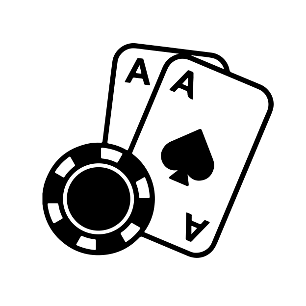
            </picture>
             
            <b>Poker Monte Carlo Engine</b>
            

            
High-performance probabilistic poker simulator with opponent modelling and optimal strategy calculation.

            

            <code>Python</code> <code>Monte Carlo</code> <code>AI/ML</code>
        </td>
        <td width="33%" height="200" align="center">
            

            <picture>
                <source media="(prefers-color-scheme: dark)" srcset=".assets/img/project_icons/pcb_light.svg">
                <source media="(prefers-color-scheme: light)" srcset=".assets/img/project_icons/pcb_dark.svg">
                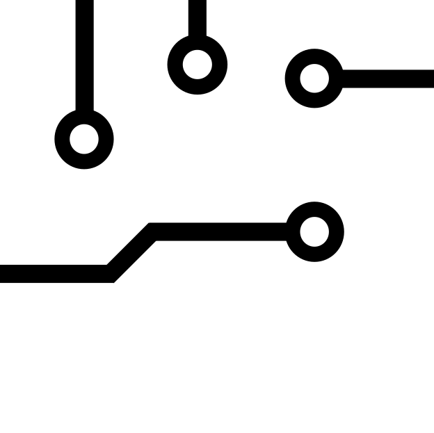
            </picture>
             
            <b>Custom PCB Designs</b>
            

            
Multi-layer PCB designs including RP2040 development boards and hybrid analog-digital computing modules.

            

            <code>KiCad</code> <code>PCB Design</code> <code>Embedded</code>
        </td>
    </tr>
</table>

 

## Research & Publications

### Past Research Projects

- *Accelerating Simulations with Analogous Hardware: A Scalable Dataflow Architecture for High-Performance Molecular Dynamics* (2022-2025)
- *Development of quantum computing algorithms to explore cyclic peptides* (2021)
- *Computational validation of macromolecular structural models* (2019-2020)
- *Coarse-grained Monte Carlo simulations to probe confined protein diffusion in the Gram-negative bacterial outer membrane* (2018-2019)
- *Computational analysis of mechanical protein unfolding using atomic force microscopy data* (2018-2019)

### Selected Publications

- **Rochira, W.** & Biggin, P.C. *Unconventional computing for the acceleration of molecular simulations.* (In preparation)
- Agirre et al. *The CCP4 suite: integrative software for macromolecular crystallography.* (2022)
- **Rochira, W.** & Agirre, J. *Iris: interactive all-in-one graphical validation of 3D protein model iterations.* (2020)

<!-- Acta Crystallographica Section D. DOI: 10.1107/s2059798323003595 -->
<!-- Protein Science. DOI: 10.1002/pro.3955 -->

 

## Open to Opportunities

I'm currently open to freelancing opportunities or full-time positions, particularly in:
- Scientific computing
- Computational research
- Hardware-software co-design
- Data science & machine learning

I'd be delighted to discuss relevant opportunities or collaborations.

<h3><a href=".assets/pdf/William%20Rochira%20CV%202025-09-22.pdf">Download my CV</a></h3>
